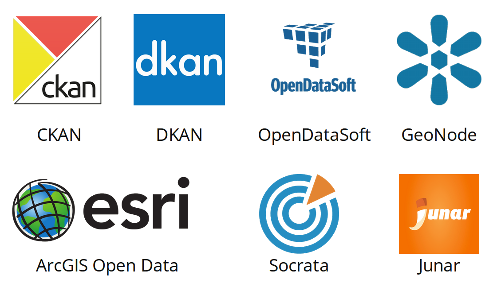
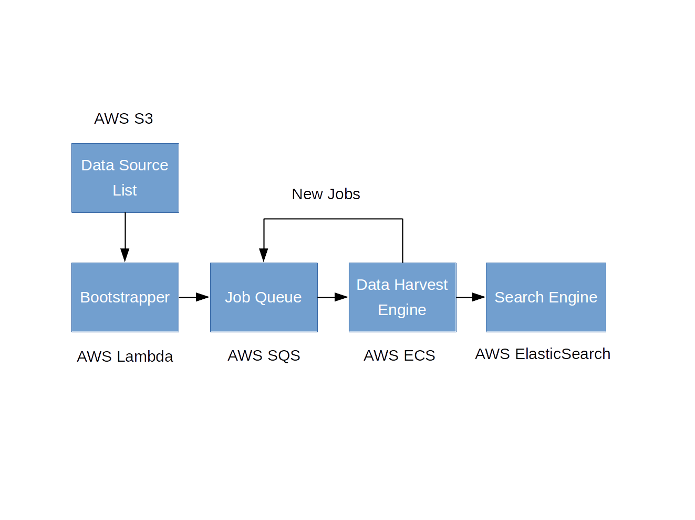

# SingularData Data Engine

[](https://travis-ci.org/SingularData/data-engine)

This repository hosts the data harvesting engine for [SingularData](https://singulardata.github.io/).

## Idea

Many open data providers provide API that exposes a full list of published datasets. A program can be developed to collect metadata from these APIs and create a unified search index.

A survey on the data provider shows that the following platforms are providing standarized APIs that allow 3rd party developrs to harvest.



## Design

An continuously data harvest system is built on several AWS services:

* **S3** to store the [data source list](https://raw.githubusercontent.com/SingularData/data-source/master/data/data-sources.json)

* **Lambda** function to publish data harvesting jobs weekly

* **SQS** to store data harvesting jobs for future execution

* **ECS** to host a dockerized Node.js for continuously executing data harvesting and update the search index with harvested metadata.

* **ElasticSearch** to provide search service



A workflow of the system is

1.  The [bootstrapper](src/bootstrapper/index.ts) lambda function reads the data source list from S3 and publish a series of `FetchSource` jobs in the SQS queue. This function is scheduled to run every week.

2.  The [data engine](scr/engine) will keep pulling jobs from the SQS queue and execute them based on their types (see next section).

3.  The search index will be updated every time when a harvesting job is done.

## Harvesting Engine

The harvesting engine is a program that continuously runs the pull-and-process for jobs from the SQS queue. A job has the following data structure:

```javascript
{
  // message id used by aws sdk
  "messageId": "SQS message id",
  // type of job
  "type": "job type",
  "data": {
    // type-specific data
  }
}
```

Each job type has different handling logic:

* For the **FetchSource** job, the data engine will send a request to the given data source and retrieve all scrapable urls. A `FetchDataset` job will be published for each url for data scrapping.

* For the **FetchDataset** job, the data engine will

1.  download all dataset metadata from the given url
2.  filter out already existing dataset metadata
3.  convert new dataset metadata into [W3C DCAT](https://www.w3.org/TR/vocab-dcat/) schema
4.  publish within `IndexDataset` jobs

* For the **IndexDataset** job, data engine will index all dataset metadata with bulk index request.

## License

MIT
