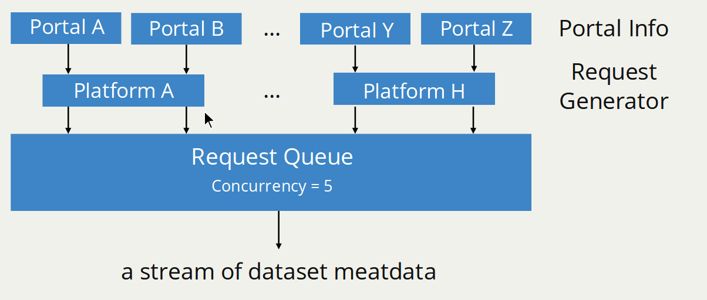
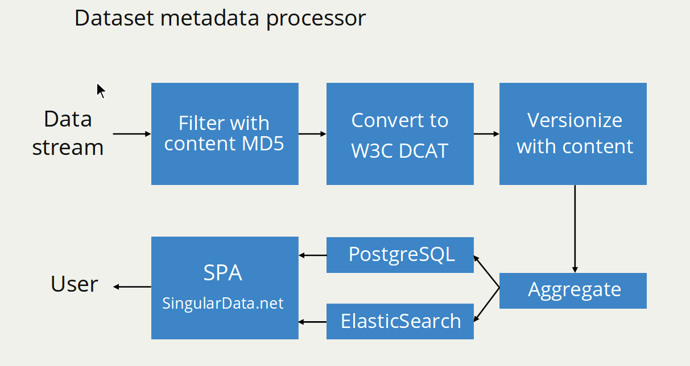

# [SingularData.net](http://singulardata.net/) Data Pipeline

A data pipeline to collect and index data metadata from more than 1,000 open data portals.


## How does it work?

### Portal Metadata Request

The open data metadata collection is possible by open data portals providing standardized APIs to allow developers to harvest dataset metadata. For example, the platform [ArcGIS Open Data](https://hub.arcgis.com/pages/open-data) provides a publich API to download all dataset metadata in a portal built with it.

```
GET http://data.cityofmadison.opendata.arcgis.com/data.json
```

This API will output a list of dataset metadata in the portal, which includes basic information like title, keyworks, description, etc.

Even there are hundreds of different data portals built with ArcGIS, they have the same `/data.json` API to export dataset metadata in the same format. A request generator can be built to digest portal URLs, construct metadata request, and send for dataset metadata.

Many open data platforms provide standardized open APIs. In this data pipeline, different requester generators are developed to work with different open data platforms. So far this data pipeline supports [ArcGIS Open Data](https://hub.arcgis.com/pages/open-data), [CKAN](https://ckan.org/), [DKAN](https://getdkan.org/), [GeoNode](http://geonode.org/), [Junar](http://junar.com/index9ed2.html?lang=en), [OpenDataSoft](https://www.opendatasoft.com/), [Socrata](https://socrata.com/).



### Stream Processing

More than 1,000 data portals are harvested by this data pipeline. A stream processing is used to optimize the procedure and reduce required resources.

Collected dataset metadata from each request will be emitted a stream of metadata. Each metadata is processed in the following steps:

* Filter with the existing metadata in the database based on the content hash and remove existing ones.
* Convert the dataset metadata into a format based on [W3C Data Catalog Vocabulary](https://www.w3.org/TR/vocab-dcat/) (DCAT)
* Give a version number to each new or updated metadata
* Aggregate them into chunks
* Save into Database and ElasticSearch service


