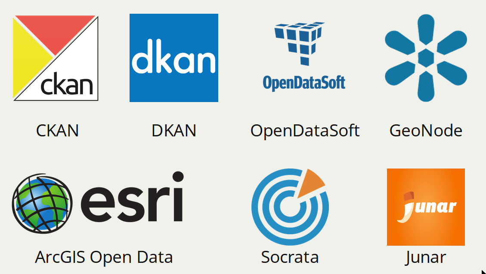

# [SingularData.net](http://singulardata.net/) Data Pipeline

A data pipeline to collect, transform, and index open data metadata from various data sources.

## Idea

Open data is a great resource to learn, study, and discover our community. But finding suitable data is never an easy job even thought more data are open and more data portals are established. Here is the problem: we are in an ocean of open data and what we are looking at is the data in a island with unknown coordinates.

Can we have a service that directly tells us where the dataset is, without checking each data provider or portal? No yet, but this is what I want to see and intent to do.

This is a data pipeline that collects open data metadata from various open data providers and build a universal search index.

## System Design

The data pipeline is built on the top of AWS:

* **S3** to store the [data provider list](link here)

* **Lambda** to generate, schedule, and execute jobs

* **SNS** to transfer jobs between lambda functions

* **DynamoDB** to store checksums of dataset metadata for duplication/update check

* **ElasticSearch** to create search index for the transformed open data metadata (I am currently using AWS ElasticSearch Service)

## Workflow

### Bootstrapping

The [bootstrapper]() lambda function is to read the open data provider list, which is currently stored in at S3, and publish a `FetchSource` job with the provider information to a AWS SNS queue _fetch-queue_.

#### Fetching Metadata

The [fetcher]() lambda function subscribes to the _fetch-queue_ queue.

**FetchSource**

When it receives a `FetchSource` job, the fetcher function determines the type of data provider and the way to collect data metadata from the provider.

Currently, the fetcher supports the metadata API from ArcGIS Open Data, CKAN, DKAN, GeoNode, Junar, OpenDataSoft, and Socrata. It generates urls to fetch metadata depending on the design of the API. For some APIs, they provider the one-call-get-all service to download all dataset metadata. For some APIs, we need to do the pagination to read all metadata and therefore a series urls are generated.

Then it publishes a `FetchPage` job with the provider information and the request url to the _fetch-queue_.

**FetchPage**

When it receives a `FetchPage` job, the fetcher function sends a request to the data provider to download a list of dataset metadata and then transforms into the [W3C DCAT schema](). To avoid duplicated indexing and unnecessary work, the fetcher will compute the checksum of each dataset and compare it the one stored in the DynamoDB with the same identifier. If the checksum is different, it means the dataset metadata has been updated and the fetcher can pass the metadata to the next step. If no, the dataset metadata already exists in the index and the fetcher will drops it.

All updated dataset metadata will be enqueued into the _index-queue_ for the indexing.

#### Building the Index

The [indexer](...) function subscribes the _index-queue_ and index the incoming dataset metadata into an ElasticSearch service.
